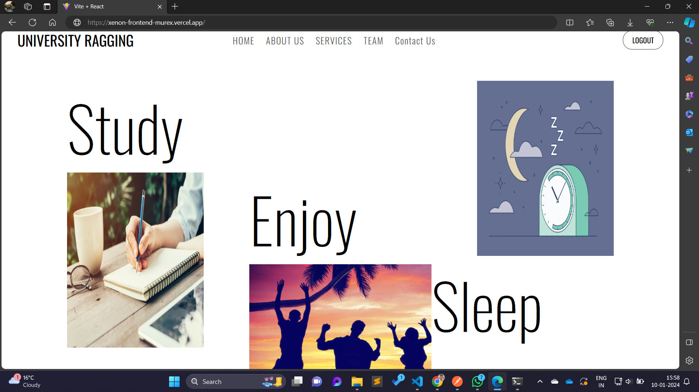
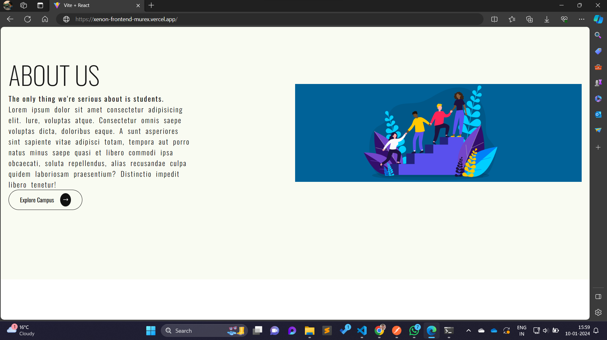
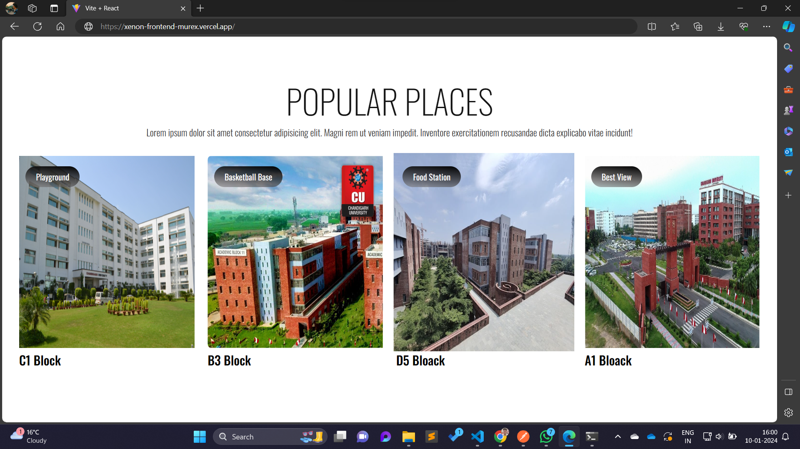
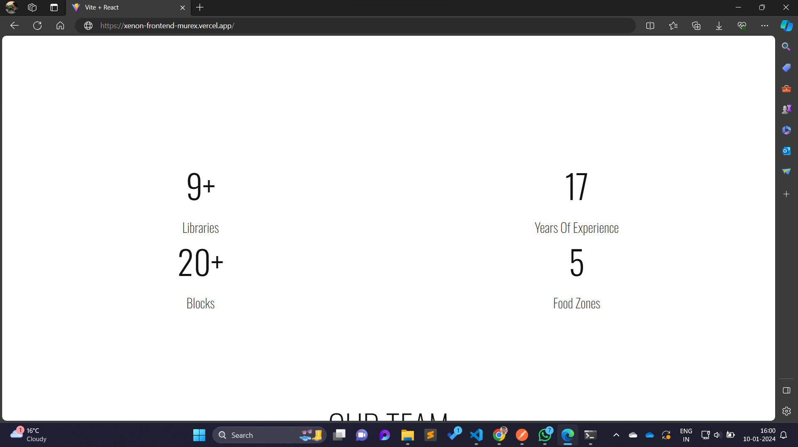
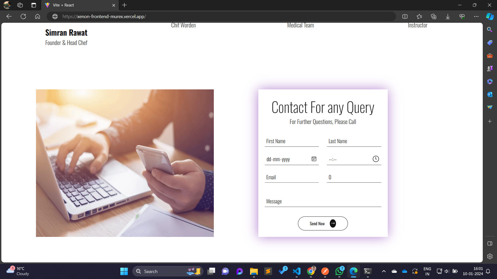
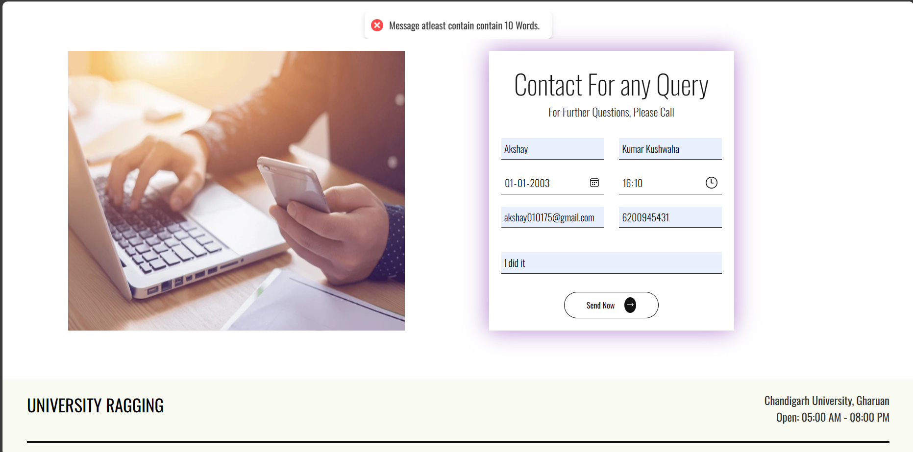
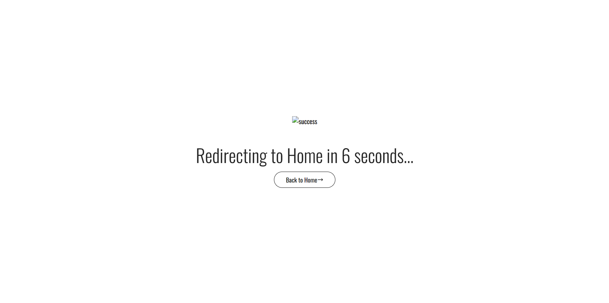
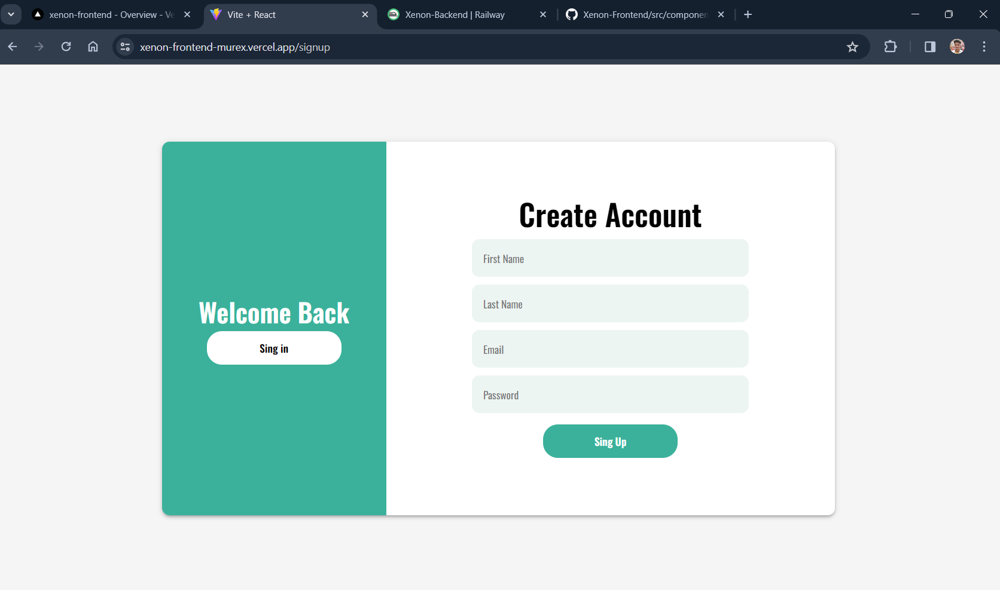
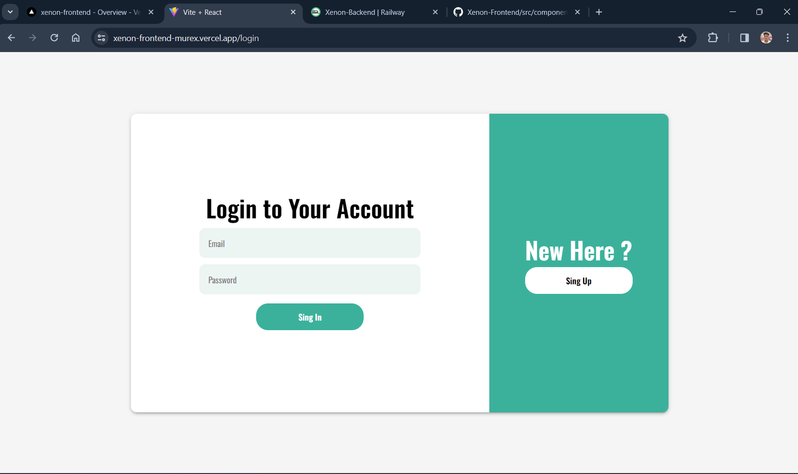
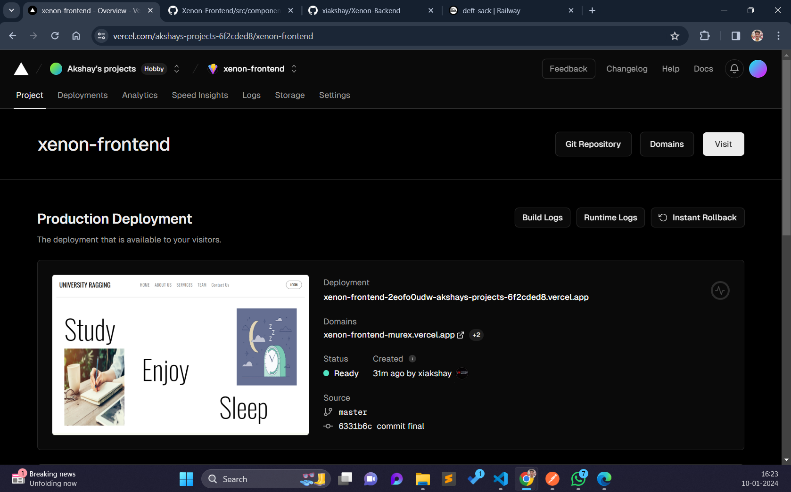

# React + Vite

This template provides a minimal setup to get React working in Vite with HMR and some ESLint rules.

Currently, two official plugins are available:

- [@vitejs/plugin-react](https://github.com/vitejs/vite-plugin-react/blob/main/packages/plugin-react/README.md) uses [Babel](https://babeljs.io/) for Fast Refresh
- [@vitejs/plugin-react-swc](https://github.com/vitejs/vite-plugin-react-swc) uses [SWC](https://swc.rs/) for Fast Refresh

> Used commands 

`npm create vite@laetst ./`
> React
>> JavaScript

`npm install`

`npm i react-router-dom axios react-icons react-scroll`

`npm i react-hot-toast`

------
Images - Website
-----
When user is Logged in - 

About us

Contact Page - 

Error if no fullfill the contact credientials

Success form after Contact Query is Successfully triggerd

Signup form

Signin form

**This website is fully responsive.**

Backend Github Repo  - https://github.com/xiakshay/Xenon-Backend

Deployed link - https://xenon-backend-production.up.railway.app

use `/api/v1/ ` after deploy link

Proof 

Frontend deploy link - https://xenon-frontend-murex.vercel.app/

Proof - 

>Fully react.Js website with Vita for fronend 
for backend used `node.js` 

**Thanksss**